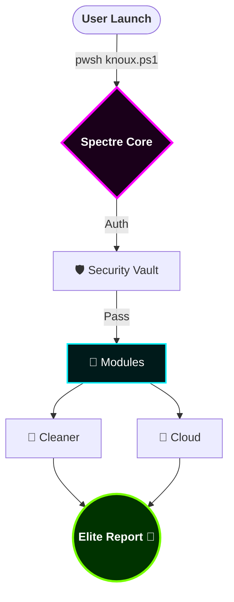

<p align="center">
  
</p>

<p align="center">
  <a href="#-the-visual-ecosystem"><b>المعرض البصري</b></a> •
  <a href="#-core-logic"><b>المنطق البرمجي</b></a> •
  <a href="#-module-ecosystem"><b>نظام الموديولات</b></a> •
  <a href="#-quick-start"><b>التشغيل السريع</b></a> •
  <a href="#-live-intel"><b>الإحصائيات</b></a>
</p>

<p align="center">
  
  
  
</p>

---

## 🪐 01. The Concept | المفهوم
**Knoux Spectre Toolbox** هو نظام هجين يدمج قوة **PowerShell 7.4** ومرونة **Node.js** مع واجهة مستخدم نيونية زجاجية. صُمم ليكون المايسترو الخاص بمشاريعك، ليدير التنظيف، الأمان، والنشر السحابي ببنية تحتية أسطورية.

> **الفلسفة:** *"Engineered by Gods, Used by Legends"* 🌌

---

## 🖼️ 02. The Visual Ecosystem | المعرض البصري (Actual UI)

<div align="center">
  <table border="0">
    <tr>
      <td><p align="center"><b>🌌 Official Logo</b><br/></p></td>
      <td><p align="center"><b>🖥️ Start Screen</b><br/></p></td>
    </tr>
    <tr>
      <td><p align="center"><b>📊 Main Dashboard</b><br/></p></td>
      <td><p align="center"><b>🛠️ Spectre Toolbox</b><br/></p></td>
    </tr>
  </table>
</div>

---

## 🧠 03. Core Logic | المنطق البرمجي (Interactive Diagram)



---

## 🚀 04. Quick Start | التشغيل السريع

```powershell
# استدعاء المحرك من السحابة مباشرة
Invoke-RestMethod -Uri "[https://raw.githubusercontent.com/knuux7-ctrl/Knoux-Spectre-Toolbox/main/knoux.ps1](https://raw.githubusercontent.com/knuux7-ctrl/Knoux-Spectre-Toolbox/main/knoux.ps1)" | iex

```

---

## 📈 05. Live Intelligence Metrics | إحصائيات حية

<p align="center">

</p>

<p align="center">


</p>

---

## 🤝 06. The Syndicate | المجتمع والتعاون

<p align="center" style="background: rgba(255,255,255,0.05); padding:20px; border-radius:15px; box-shadow:0 0 20px #ff00ff,0 0 40px #00f2ff;">

1. قم بعمل <b>Fork</b> للمشروع.


2. أنشئ موديول جديد في مجلد <code>/modules</code>.


3. ارفع <b>Pull Request</b>.
</p>

---

<p align="center">


</p>

<p align="center">
<sub>Copyright © 2025 <b>Knoux | Abu Retaj</b>. All Rights Reserved.</sub>
</p>
