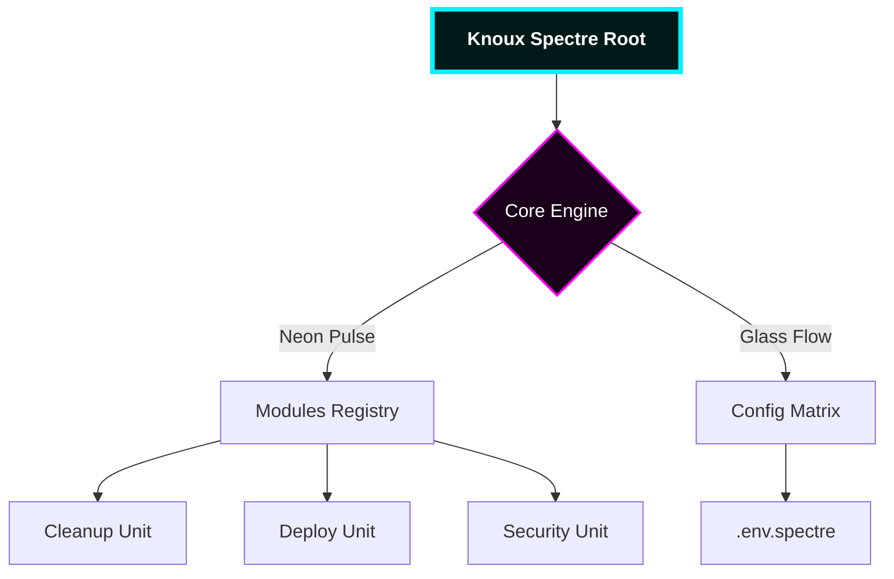

<div align="center">


<br/>

[](/)
[](/)
[](/)
[](/)

<br/>

---

### 💠 Tech Stack Matrix


---
</div>

## 🪐 The Glassmorphism Interface (Overview)
<blockquote>
  <p align="left">
    <b>Knoux Spectre Toolbox</b> is a specialized ecosystem designed to merge 
    <b>High-Speed Automation</b> with <b>Elite Visual Diagnostics</b>. 
    Built for those who demand performance without compromising on aesthetics.
  </p>
</blockquote>

---

## ⚡ Interactive Module Previews (Live Simulation)

<table width="100%">
  <tr>
    <td width="50%">
      <h3>🧹 01. System Pulsar (Cleanup)</h3>
      <p><i>The most aggressive junk-cleaner ever built.</i></p>
      <pre><code>PS> knoux --clean --aggressive
[OK] Temp Files Purged (2.4 GB)
[OK] Node_Modules Audited
[OK] Cache Flushed</code></pre>
    </td>
    <td width="50%">
      
    </td>
  </tr>
  <tr>
    <td width="50%">
      
    </td>
    <td width="50%">
      <h3>🛡️ 02. Spectre Aegis (Security)</h3>
      <p><i>Real-time project structure and ENV vulnerability scanning.</i></p>
      <pre><code>PS> knoux --audit --shield
[WARNING] .env Exposed in Root
[FIXED] Permissions Locked
[DONE] Structure Verified</code></pre>
    </td>
  </tr>
</table>

---

## 🏗️ Project Architecture (Neon Tree)



---

## 💎 Exclusive Features (The Glass Cards)

<div align="center">

| 🌌 **Neon Deployment** | 🧬 **Bio-Logic Verify** | ⚡ **Hyper-Power** |
| --- | --- | --- |
| Integration with Northflank, Vercel, and Cloudflare. | Advanced script validation before execution. | Optimized for PS 7.4 multi-threading. |
| `Status: Stable` | `Status: AI-Powered` | `Status: Turbo` |

</div>

---

## 🛠️ Deployment Instructions

<details>
<summary><b>🚀 Click to expand "The Launch Sequence"</b></summary>

### 1. Initialize Engine

```bash
git clone [https://github.com/knuux7-ctrl/Knoux-Spectre-Toolbox.git](https://github.com/knuux7-ctrl/Knoux-Spectre-Toolbox.git)
cd Knoux-Spectre-Toolbox

```

### 2. Ignition

```powershell
# Set Execution Policy
Set-ExecutionPolicy -ExecutionPolicy Bypass -Scope Process

# Launch the Spectra UI
./knoux.ps1 --interface glass

```

</details>

---

## 📈 System Metrics (Live Stats)

<p align="center">


</p>

---

## 🤝 The Spectre Syndicate (Contributing)

We welcome developers who code in the dark.

1. **Fork** the Void.
2. **Branch** the Light.
3. **Commit** the Code.

---

<div align="center">
<sub>Built with ❤️ by <b>Knoux | Abu Retaj</b> • King of Automation</sub>


</div>
