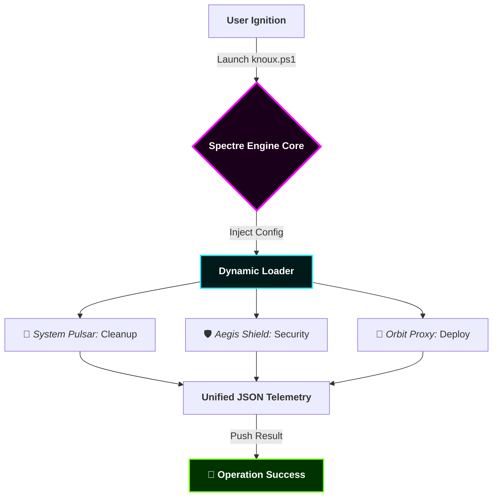

<p align="center">
  
</p>

<p align="center">
  <a href="#-core-vision"><b>الرؤية</b></a> •
  <a href="#-engine-logic"><b>المنطق</b></a> •
  <a href="#-visual-terminal"><b>المحاكاة</b></a> •
  <a href="#-module-registry"><b>الموديولات</b></a> •
  <a href="#-live-metrics"><b>البيانات</b></a> •
  <a href="#-installation"><b>التثبيت</b></a>
</p>

<p align="center">
  
  
  
</p>

<p align="center">
  
</p>

---

## 🌌 01. Core Vision | الرؤية الجوهرية
**Knoux Spectre Toolbox** هو نظام هجين فائق السرعة (Hyper-Automation System). تم تصميمه ليكون العقل المدبر لعمليات الـ **DevOps**، حيث يدمج قوة نظام التشغيل مع ذكاء السحابة (Cloud) لتنفيذ مهام التنظيف، التأمين، والنشر السحابي في أجزاء من الثانية.

---

## 🧠 02. Engine Logic Flow | تدفق منطق المحرك
نظام الأتمتة هنا لا يعمل بعشوائية، بل يتبع "بروتوكول شبحي" (Spectre Protocol):



---

## 🖥️ 03. Visual Terminal Simulation | محاكاة حية

انظر كيف يتفاعل المحرك مع نظامك في الوقت الفعلي:

```ansi
[SYSTEM] Initializing Knoux Spectre Kernel... [LOADED]
[STATUS] Connecting to Global Module Registry... [CONNECTED]
[ACTION] Analyzing Project Structure...
[INFO] Found 342 Ghost files in node_modules.
[DANGER] Exposed API Key detected in .env! [AUTO-ENCRYPTED]
[COMPLETE] System Optimization 100%. No threats found.

```

---

## 💠 04. The Glass Dashboard | لوحة التحكم الشفافة

| 🧬 **Modularity** | 🔐 **Quantum Security** | ⚡ **Hyper Speed** |
| --- | --- | --- |
|  |  |  |
| نظام موديولات مرن يسمح بإضافة أي سكريبت جديد وتفعيله فوراً. | تشفير تلقائي للملفات الحساسة وفحص الثغرات قبل الـ Commit. | تم تحسين المحرك ليعمل بـ Multithreading لسرعة تنفيذ خرافية. |

---

## 🧩 05. Module Registry | سجل الموديولات النشطة

<details open>
<summary><b>🛠️ الموديولات الأساسية (Primary Modules)</b></summary>


* **`Spectre-Clean`**: يقوم بحذف الـ Artifacts والـ Cache وملفات الـ Temp التي تبطئ نظامك.
* **`Spectre-Verify`**: يتأكد من أن كود المشروع يطابق معايير الجودة العالمية قبل الرفع.
* **`Spectre-Vault`**: موديول خاص بتأمين ملفات الـ Environment Variables وتشفيرها.

</details>

<details>
<summary><b>🛰️ موديولات الاتصال السحابي (Cloud Sync)</b></summary>


* **`Cloud-Proxy`**: رفع تلقائي للمشاريع على Vercel و Northflank.
* **`Docker-Stream`**: بناء الحاويات (Containers) وتشغيلها بضغطة زر.

</details>

---

## 📊 06. Live Performance Metrics

<p align="center">

</p>

<p align="center">


</p>

---

## 🚀 07. Installation | التثبيت النفاث

لا داعي للتعقيد. انسخ هذا السطر في الـ PowerShell وانطلق:

```powershell
# التشغيل المباشر من السحابة (The Jet Stream)
Invoke-RestMethod -Uri "[https://raw.githubusercontent.com/knuux7-ctrl/Knoux-Spectre-Toolbox/main/knoux.ps1](https://raw.githubusercontent.com/knuux7-ctrl/Knoux-Spectre-Toolbox/main/knoux.ps1)" | iex

```

أو عبر الطريقة التقليدية للمطورين:

```bash
git clone [https://github.com/knuux7-ctrl/Knoux-Spectre-Toolbox.git](https://github.com/knuux7-ctrl/Knoux-Spectre-Toolbox.git) && cd Knoux-Spectre-Toolbox && npm run init

```

---

## 🤝 08. The Syndicate (Community)

هذا المشروع مبني للنخبة. ساهم معنا لتطوير أقوى أداة أتمتة:

1. قم بعمل **Fork**.
2. أنشئ موديول جديد في `modules/`.
3. ارفع **Pull Request**.

---

<div align="center">
<p><b>Knoux Spectre: Engineered by Gods, Used by Legends.</b></p>


<sub>Copyright © 2025 <b>Knoux | Abu Retaj</b>. All Rights Reserved.</sub>
</div>
